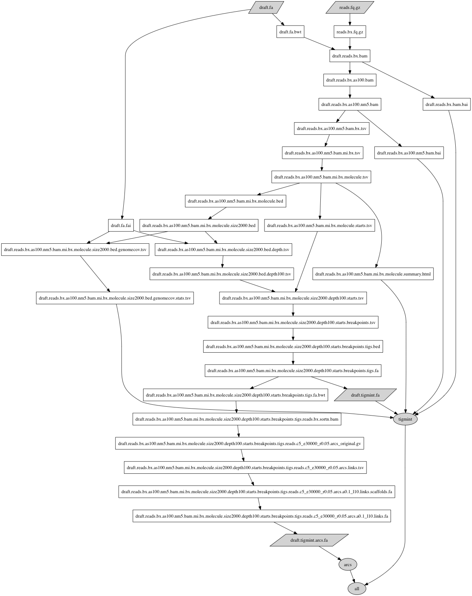

# Correct misassemblies using Linked Reads

Split sequences at positions with low depth of coverage and high number of molecule starts.

Written by [Shaun Jackman](http://sjackman.ca).

[Poster](https://f1000research.com/posters/6-1406)
and slides
[HTML](http://sjackman.ca/tigmint-slides/)
&middot; [PDF](https://github.com/sjackman/tigmint-slides/blob/master/tigmint-slides.pdf)
&middot; [Markdown](https://github.com/sjackman/tigmint-slides/)

# Description

Tigmint identifies and corrects misassemblies using linked reads from 10x Genomics Chromium. The reads are first aligned to the assembly, and the extents of the large DNA molecules are inferred from the alignments of the reads. The physical coverage of the large molecules is more consistent and less prone to coverage dropouts than that of the short read sequencing data. Atypical drops in physical molecule coverage, less than the median minus two times the inter-quartile range, reveal possible misassemblies. Clipped alignments of the first and last reads of a molecule are used to refine the coordinates of the misassembly with base-pair accuracy.

# Installation

Download and extract the source code. Compiling is not needed.

```
git clone https://github.com/bcgsc/tigmint && cd tigmint
```
or
```
curl -L https://github.com/bcgsc/tigmint/archive/master.tar.gz | tar xz && mv tigmint-master tigmint && cd tigmint
```

# Dependencies

Dependencies may be installed using [Homebrew](https://brew.sh) on macOS or [Linuxbrew](http://linuxbrew.sh) on Linux.

## Install the dependencies of Tigmint
```sh
brew tap homebrew/science
brew install bedtools bwa gawk gnu-sed miller pigz r samtools seqtk
Rscript -e 'install.packages(c("ggplot2", "rmarkdown", "tidyverse", "uniqtag"))'
```

## Install the dependencies of ARCS (optional)
```sh
brew install arcs links-scaffolder
```

## Install the dependencies for calculating assembly metrics (optional)
```sh
brew install abyss
```

# Usage

Change your current working directory to the directory in which Tigmint is installed: `cd tigmint`

To run Tigmint on the draft assembly `myassembly.fa` with the reads `myreads.fq.gz`, which have been run through `longranger basic`:

```sh
tigmint-make tigmint draft=myassembly reads=myreads
```

To run both Tigmint and scaffold the corrected assembly with [ARCS](https://github.com/bcgsc/arcs):

```sh
tigmint-make arcs draft=myassembly reads=myreads
```

To run Tigmint, ARCS, and calculate assembly metrics using the reference genome `GRCh38.fa`:

```sh
tigmint-make metrics draft=myassembly reads=myreads ref=GRCh38 G=3088269832
```

# Note

+ `tigmint-make` is a Makefile script, and so any `make` options may also be used with `tigmint-make`, such as `-n` (`--dry-run`).
+ The file extension of the assembly must be `.fa` and the reads `.fq.gz`, and the extension is not included in the parameters `draft` and `reads`. These specific file name requirements result from implementing the pipeline in GNU Make.

# Commands

+ `tigmint`: Run Tigmint, and produce a file named `$draft.tigmint.fa`
+ `arcs`: Run Tigmint and ARCS, and produce a file name `$draft.tigmint.arcs.fa`
+ `metrics`: Run, Tigmint, ARCS, and calculate assembly metrics using `abyss-fac` and `abyss-samtobreak`, and produce TSV files.

# Parameters of Tigmint

+ `draft`: Name of the draft assembly, `draft.fa`
+ `reads`: Name of the reads, `reads.fq.gz`
+ `depth_threshold=100`: Depth of coverage threshold
+ `starts_threshold=2`: Number of molecule starts threshold
+ `minsize=2000`: Minimum molecule size
+ `as=100`: Minimum alignment score
+ `nm=5`: Maximum number of mismatches
+ `t=8`: Number of threads
+ `gzip=gzip`: gzip compression program, use `pigz -p8` for parallelized compression

# Parameters of ARCS
+ `c=5`
+ `e=30000`
+ `r=0.05`

# Parameters of LINKS
+ `a=0.1`
+ `l=10`

# Parameters for calculating assembly metrics

+ `ref`: Reference genome, `ref.fa`, for calculating assembly contiguity metrics
+ `G`: Size of the reference genome, for calculating NG50 and NGA50

# Support

After first looking for existing issue at <https://github.com/bcgsc/tigmint/issues>, please report a new issue at <https://github.com/bcgsc/tigmint/issues/new>. Please report the names of your input files, the exact command line that you are using, and the entire output of `tigmint-make`.

# Pipeline

[Makefile](tigmint-make) &middot; [CWL](tigmint-make.cwl) &middot; [CWLViewer](https://view.commonwl.org/workflows/github.com/bcgsc/tigmint/tree/master/tigmint-make.cwl)

[](tigmint-make.gv.svg)
