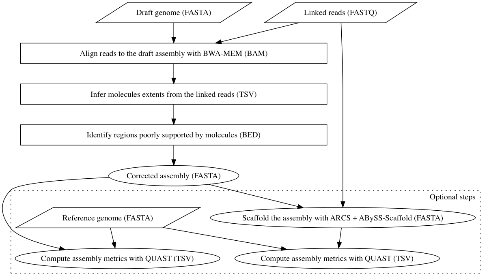

[](https://github.com/bcgsc/tigmint/releases)
[](https://anaconda.org/bioconda/tigmint)
[](https://github.com/bcgsc/tigmint/issues)


# Correct misassemblies in genome assembly drafts using linked or long sequencing reads

Cut sequences at positions with few spanning molecules.

Written by [Shaun Jackman](http://sjackman.ca), Lauren Coombe, Justin Chu, and Janet Li.

[Paper](https://doi.org/10.1186/s12859-018-2425-6) &middot; [Slides](http://sjackman.ca/tigmint-recomb-slides) &middot; [Poster](https://f1000research.com/posters/7-481)

# Citation

Shaun D. Jackman, Lauren Coombe, Justin Chu, Rene L. Warren, Benjamin P. Vandervalk, Sarah Yeo, Zhuyi Xue, Hamid Mohamadi, Joerg Bohlmann, Steven J.M. Jones and Inanc Birol (2018). Tigmint: correcting assembly errors using linked reads from large molecules. BMC Bioinformatics, 19(1). [doi:10.1186/s12859-018-2425-6](https://doi.org/10.1186/s12859-018-2425-6)

# Description

Tigmint identifies and corrects misassemblies using linked (e.g. MGI's stLFR, 10x Genomics Chromium) or long (e.g. Oxford Nanopore Technologies long reads) DNA sequencing reads. The reads are first aligned to the assembly, and the extents of the large DNA molecules are inferred from the alignments of the reads. The physical coverage of the large molecules is more consistent and less prone to coverage dropouts than that of the short read sequencing data. The sequences are cut at positions that have insufficient spanning molecules. Tigmint outputs a BED file of these cut points, and a FASTA file of the cut sequences.

Tigmint also allows the use of long reads from Oxford Nanopore Technologies. The long reads are segmented and assigned barcodes, and the following steps of the pipeline are the same as described above.

Each window of a specified fixed size is checked for a minimum number of spanning molecules. Sequences are cut at those positions where a window with sufficient coverage is followed by some number of windows with insufficient coverage is then followed again by a window with sufficient coverage.

# Installation

## Install Tigmint using Brew

```sh
brew install tigmint
```

## Install Tigmint using Conda

```sh
conda install -c bioconda tigmint
```

## Run Tigmint using Docker

```sh
docker run quay.io/biocontainers/tigmint
```

## Install Tigmint from the source code

Download and extract the source code.

```
git clone https://github.com/bcgsc/tigmint && cd tigmint
make -C src
```
or
```
curl -L https://github.com/bcgsc/tigmint/releases/download/v1.2.7/tigmint-1.2.7.tar.gz | tar xz && cd tigmint-1.2.7
make -C src
```

# Dependencies

## Install Python package dependencies
```sh
conda install -c bioconda intervaltree pybedtools pysam numpy bedtools minimap2 bwa zsh btllib samtools
```

## Install the dependencies of ARCS (optional)
```sh
conda install -c bioconda arcs links
```

## Install the dependencies for calculating assembly metrics (optional)
```sh
conda install -c bioconda abyss seqtk
```

# Usage


To run Tigmint on the draft assembly `myassembly.fa` with the reads `myreads.fq.gz`, which have been run through `longranger basic`:

```sh
tigmint-make tigmint draft=myassembly reads=myreads
```

- `bwa mem -C` is used to copy the BX tag from the FASTQ header to the SAM tags.
- `samtools sort -tBX` is used to sort first by barcode and then position.


To run both Tigmint and scaffold the corrected assembly with [ARCS](https://github.com/bcgsc/arcs):

```sh
tigmint-make arcs draft=myassembly reads=myreads
```

To run Tigmint, ARCS, and calculate assembly metrics using the reference genome `GRCh38.fa`:

```sh
tigmint-make metrics draft=myassembly reads=myreads ref=GRCh38 G=3088269832
```
***

To run Tigmint with long reads in fasta or fastq format (`myreads.fa.gz` or `myreads.fq.gz` - or uncompressed) on the draft assembly `myassembly.fa` for an organism with a genome size of gsize:

```sh
tigmint-make tigmint-long draft=myassembly reads=myreads span=auto G=gsize dist=auto
```

- `minimap2 map-ont` is used to align long reads from the Oxford Nanopore Technologies (ONT) platform, which is the default input for Tigmint. To use PacBio long reads specify the parameter `longmap=pb`. The former calls `minimap2 -x map-ont` while the latter calls `minimap2 -x map-pb` instead. When using PacBio HiFi long reads, specify the parameter `longmap=hifi`.


# Notes

+ `tigmint-make` is a Makefile script, and so any `make` options may also be used with `tigmint-make`, such as `-n` (`--dry-run`).
+ When running Tigmint with linked reads, the file extension of the assembly must be `.fa` and the reads `.fq.gz`, and the extension should NOT be included in the parameters `draft` and `reads` on the command line (otherwise you will get an error). These specific file name requirements result from implementing the pipeline in GNU Make.
  + The requirements for running Tigmint with long reads are the same, but the file extension of the reads file can also be `.fa`, `.fa.gz`, or `.fq`
+ The minimum spanning molecules parameter (`span`) for `tigmint-cut` is heavily dependent on the sequence coverage of the linked or long reads provided. When running Tigmint with long reads, use `span=auto` and set `G` to your assembly organism's haploid genome size for this parameter to be calculated automatically, or explicitly set `span` to a specific number if you are interested in adjusting it. See [Tips](#Tips) for more details. 
+ For `tigmint-long`, the maximum distance between reads threshold should be calculated automatically based on the read length distribution. This can be done by setting the parameter `dist=auto`.
+ The `long-to-linked-pe` step of `tigmint-long` uses a maximum of 6 threads

# tigmint-make commands

+ `tigmint`: Run Tigmint, and produce a file named `$draft.tigmint.fa`
+ `tigmint-long`: Run Tigmint using long reads, and produce a file named `$draft.cut$cut.tigmint.fa`
+ `arcs`: Run Tigmint and ARCS, and produce a file name `$draft.tigmint.arcs.fa`
+ `metrics`: Run, Tigmint, ARCS, and calculate assembly metrics using `abyss-fac` and `abyss-samtobreak`, and produce TSV files.

# Parameters of Tigmint

+ `draft`: Name of the draft assembly, `myassembly.fa`
+ `reads`: Name of the reads, `myreads.fq.gz`
+ `G`: Haploid genome size of the draft assembly organism. Required to calculate `span` parameter automatically. Can be given as an integer or in scientific notation (e.g. '3e9' for human) [0]
+ `span=20`: Number of spanning molecules threshold. Set `span=auto` to automatically select span parameter (currently only recommended for `tigmint-long`)
+ `cut=500`: Cut length for long reads (`tigmint-long` only)
+ `longmap=ont`: Long read platform; `ont` for Oxford Nanopore Technologies (ONT) long reads, `pb` for PacBio long reads (`tigmint-long` only)
+ `window=1000`: Window size (bp) for checking spanning molecules
+ `minsize=2000`: Minimum molecule size
+ `as=0.65`: Minimum AS/read length ratio
+ `nm=5`: Maximum number of mismatches
+ `dist=50000`: Maximum distance (bp) between reads to be considered the same molecule. Set `dist=auto` to automatically calculate dist threshold based on read length distribution (`tigmint-long` only)
+ `mapq=0`: Mapping quality threshold
+ `trim=0`: Number of bases to trim off contigs following cuts
+ `t=8`: Number of threads
+ `ac=3000`: Minimum contig length (bp) for tallying attempted corrections. This is for logging purposes only, and will not affect the performance.
+ `SORT_OPTS`: specify any options to be used for `sort`


# Parameters of ARCS
+ `c=5`
+ `e=30000`
+ `r=0.05`

# Parameters of LINKS
+ `a=0.1`
+ `l=10`

# Parameters for calculating assembly metrics

+ `ref`: Reference genome, `ref.fa`, for calculating assembly contiguity metrics
+ `G`: Size of the reference genome, for calculating NG50 and NGA50

# Tips

- If your barcoded reads are in multiple FASTQ files, the initial alignments of the barcoded reads to the draft assembly can be done in parallel and merged prior to running Tigmint.
- When aligning linked reads with BWA-MEM, use the `-C` option to include the barcode in the BX tag of the alignments.
- Sort by BX tag using `samtools sort -tBX`.
- Merge multiple BAM files using `samtools merge -tBX`.
- When aligning long reads with Minimap2, use the `-y` option to include the barcode in the BX tag of the alignments.
- When using long reads, the minimum spanning molecule thresholds (`span`) should be no greater than 1/4 of the sequence coverage. Setting the parameter `span=auto` allows the appropriate parameter value to be selected automatically (this setting requires the parameter `G` as well).
- When using long reads, the edit distance threshold (`nm`) is automatically set to the cut length (`cut`) to compensate for the higher error rate and length. This parameter should be kept relatively high to include as many alignments as possible.
- Each Tigmint (and Tigmint-long) step can be run separately through specifying the target using `tigmint-make`. For example, the bwa index step for Tigmint with linked reads can be launched with `tigmint-make tigmint-index`
  - Tigmint steps\targets (for linked reads): `tigmint-index`, `tigmint-align`, `tigmint-molecule`, `tigmint-cut`
  - Tigmint-long steps\targets: `tigmint-long-estimate`, `tigmint-long-to-linked`, `tigmint-long-cut`
- In the command line, `SORT_OPTS` can be specified to add options used for `sort`

# Using stLFR linked reads

To use stLFR linked reads with Tigmint, you will need to re-format the reads to have the barcode in a `BX:Z:` tag in the read header.
For example, this format
```
@V100002302L1C001R017000000#0_0_0/1 0	1
TGTCTTCCTGGACAGCTGACATCCCTTTTGTTTTTCTGTTTGCTCAGATGCTGTCTCTTATACACATCTTAGGAAGACAAGCACTGACGACATGATCACC
+
FFFFFFFGFGFFGFDFGFFFFFFFFFFFGFFF@FFFFFFFFFFFF@FFFFFFFFFGGFFEFEFFFF?FFFFGFFFGFFFFFFFGFFEFGFGGFGFFFGFF
```
should be changed to:
```
@V100002302L1C001R017000000 BX:Z:0_0_0
TGTCTTCCTGGACAGCTGACATCCCTTTTGTTTTTCTGTTTGCTCAGATGCTGTCTCTTATACACATCTTAGGAAGACAAGCACTGACGACATGATCACC
+
FFFFFFFGFGFFGFDFGFFFFFFFFFFFGFFF@FFFFFFFFFFFF@FFFFFFFFFGGFFEFEFFFF?FFFFGFFFGFFFFFFFGFFEFGFGGFGFFFGFF
```

# Support

After first looking for existing issue at <https://github.com/bcgsc/tigmint/issues>, please report a new issue at <https://github.com/bcgsc/tigmint/issues/new>. Please report the names of your input files, the exact command line that you are using, and the entire output of Tigmint.

# Pipeline

[](pipeline.gv.svg)
